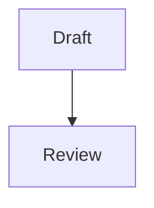

# @f12o/papyr-markdown

`@f12o/papyr-markdown` は Markdown と `PapyrDocument` の境界を担当します。Papyr を導入するときに最初に触ることが多い package です。

主な公開 API は 2 つだけです。

`parseMarkdown(input, options)` は Markdown 文字列から `PapyrDocument` を
作り、`serializeDocument(doc)` は `PapyrDocument` の block 列を Markdown
に戻します。

## この package が担当する範囲

heading、paragraph、list、code、inline marks、link の変換と、
`papyr-table`、`papyr-moonlight`、`mermaid` フェンスの変換を担当します。

## 担当しない範囲

frontmatter の parse や serialize、ファイル I/O、storage や publication
metadata の管理は担当しません。

frontmatter が必要なときは、この docs site の build と同じように `gray-matter` などを前段に置くのが分かりやすい構成です。

## 最小コード

```ts
import { parseMarkdown, serializeDocument } from "@f12o/papyr-markdown";

const doc = parseMarkdown("# Hello\n\n- write\n- preview", {
  documentId: "hello",
});

console.log(doc.blocks.map((block) => block[0])); // ['Heading', 'List']

const source = serializeDocument(doc);
console.log(source);
```

## 特殊 block

Mermaid は通常の fenced code block と同じ書き方で `Mermaid` block になります。

````md

````

Papyr 固有の table や Moonlight payload は、`papyr-table` / `papyr-moonlight` fence に JSON として保存します。GFM table で表現できる単純な table は Markdown table として round-trip できます。
