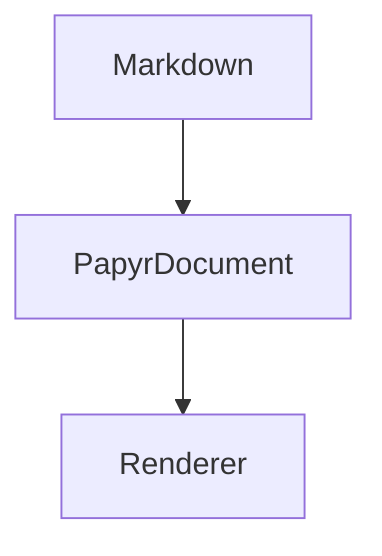

# 特殊フェンス

`@f12o/papyr-markdown` は 3 種類のフェンスを扱います。

`papyr-table` は `TableBlock` の payload、`papyr-moonlight` は
`MoonlightBlock` の payload、`mermaid` は Mermaid のソース文字列です。

独自 placeholder や HTML 断片を混ぜず、Markdown 拡張はすべてフェンスで扱う方針です。

## papyr-table の例

```papyr-table
{
  "columns": [{ "key": "name", "header": "key" }, { "key": "value", "header": "value" }],
  "rows": [[{ "text": "kind" }, { "text": "book" }]]
}
```

## papyr-moonlight の例

```papyr-moonlight
{
  "svg": "<svg viewBox=\"0 0 220 100\" role=\"img\" aria-label=\"Papyr\" xmlns=\"http://www.w3.org/2000/svg\"><rect x=\"10\" y=\"10\" width=\"180\" height=\"80\" rx=\"10\" fill=\"#eef9f6\" stroke=\"#1f6f5f\" stroke-width=\"2\" /><text x=\"34\" y=\"58\" fill=\"#1f2629\" font-size=\"24\">Papyr</text></svg>"
}
```

## mermaid と復元時のルール



これにより、原稿はテキストとして読みやすく、保存時は JSON 構造を失いません。

`papyr-table` と `papyr-moonlight` では、`type` や `id` は Markdown 側に書きません。Papyr が parse 時に block として復元するときに付与します。
