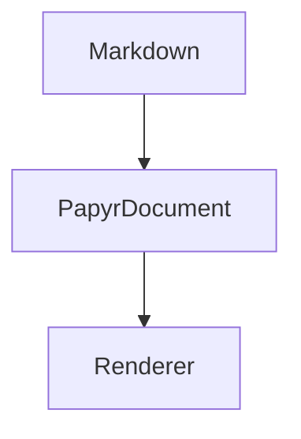

# 特殊フェンス

`@f12o/papyr-markdown` は 3 種類のフェンスを扱います。

`papyr-table` は `TableBlock` の payload、`papyr-excalidraw` は
`ExcalidrawBlock` の payload、`mermaid` は Mermaid のソース文字列です。

独自 placeholder や HTML 断片を混ぜず、Markdown 拡張はすべてフェンスで扱う方針です。

## papyr-table の例

```papyr-table
{
  "columns": [{ "key": "name", "header": "key" }, { "key": "value", "header": "value" }],
  "rows": [[{ "text": "kind" }, { "text": "book" }]]
}
```

## papyr-excalidraw の例

```papyr-excalidraw
{
  "elements": [
    { "type": "rectangle", "x": 0, "y": 0, "width": 180, "height": 80 },
    { "type": "text", "x": 24, "y": 28, "text": "Papyr" }
  ]
}
```

## mermaid と復元時のルール



これにより、原稿はテキストとして読みやすく、保存時は JSON 構造を失いません。

`papyr-table` と `papyr-excalidraw` では、`type` や `id` は Markdown 側に書きません。Papyr が parse 時に block として復元するときに付与します。
